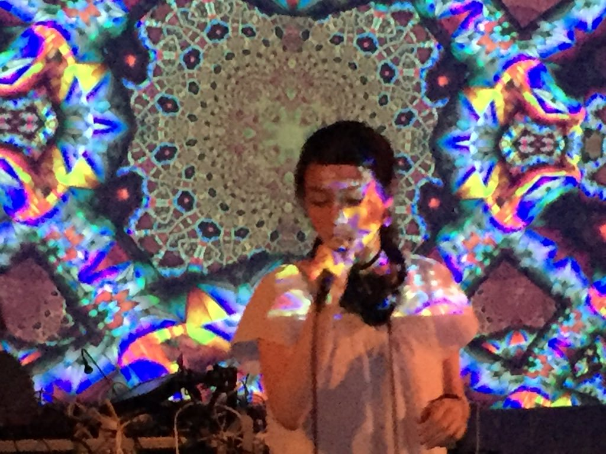

## 5th ACM SIGPLAN International Workshop on Functional Art, Music, Modelling and Design

# Call for Performances

### Oxford, UK, 9th September 2017

Functional Programming has emerged as a mainstream software development paradigm, and its artistic and creative use is booming. A growing number of environments for art, music and design now employ functional programming languages and techniques. The ACM SIGPLAN [International Workshop on Functional Art, Music, Modelling and Design](http://functional-art.org/2017/) (also known as FARM) gathers together people who are harnessing functional programming techniques in the pursuit of creativity and expression. Our fifth workshop takes place in Oxford UK, on 9th September 2017, as part of the [International Conference on Functional Programming](http://icfp17.sigplan.org/home).

FARM also hosts a traditional evening of performances. For this year’s event, FARM 2017 is seeking proposals for live performances which employ functional programming techniques, in whole or in part. We would like to support a diverse range of performing arts, including music, dance, video animation, and performance art.

We encourage both risk-taking proposals which push forward the state of the art and refined presentations of highly-developed practice. In either case, please support your submission with a clear description of your performance including how your performance employs functional programming and a discussion of influences and prior art as appropriate.

### Submission process

Please submit a brief outline/programme note (100-200 words), a stable link to a single video example, possibly a stable link to one additional audio example, and a short biography (100-150 words for each contributor).

Please include a complete technical description of what is needed from the organizers for your performance, including equipment, space requirements, and internet access. We are unlikely to be able to accommodate performances exceeding 20 minutes in length.

We prefer submissions in plaintext/markdown, odf (libre office), doc/docx (microsoft word) or pdf formats.

Send your submission to: [`performance@functional-art.org`](mailto:performance@functional-art.org)

We will confirm receipt by return.

### Performance Venue

The venue for the evening FARM performances will be the [Old Fire Station](https://oldfirestation.org.uk/) theatre in Oxford, an excellent venue which has audio/visual facilities and fully sprung dance floor. You can [download the technical specifications here](https://oldfirestation.org.uk/hires/perform-at-the-old-fire-station/).

### Documentation

A summary of the performances will be published as part of the conference proceedings. As with presentations, all performances at FARM 2017 will be recorded. Permission to publish the resulting video (in all probability on YouTube, along with the videos of ICFP itself and the other ICFP-colocated events) will be requested on-site. 

### Finances

The performance evening will be free entry, although tickets will be limited. Unfortunately we are not able to offer an artist fee. In order to support broad participation we are able to offer the following, thanks to the support of ICFP and its sponsors.

* If you are an independent artist performing in the evening, but not presenting a paper during the daytime workshop, we are able to offer free registration to the workshop, and may also be able to support inland travel expenses in some circumstances. 
* If you do not fit the description of “independent artist who is not presenting a paper at the workshop”, but would nonetheless have financial difficulty attending, there is still the opportunity to apply for conference “PAC” funds. 

Please get in touch for more information in either case.

### Key Dates:

<table>
<tr>
<td style="padding-right:10px">Submission deadline</td><td>
<a href="https://www.timeanddate.com/worldclock/fixedtime.html?msg=FARM+2017+Performance%20Submission+Deadline&iso=20170618T235959&p1=3399">18th June
2017</a></td>
</tr>

<tr>
<td style="padding-right:10px">Notification</td>
<td>1st July 2017</td>
</tr>

<tr>
<td style="padding-right:10px">FARM workshop + performance evening</td>
<td>9th September 2017</td>
</tr>
</table>

### Questions

Please direct all questions and suggestions to the performance chair (Alex McLean): [`performance@functional-art.org`](mailto:performance@functional-art.org)

