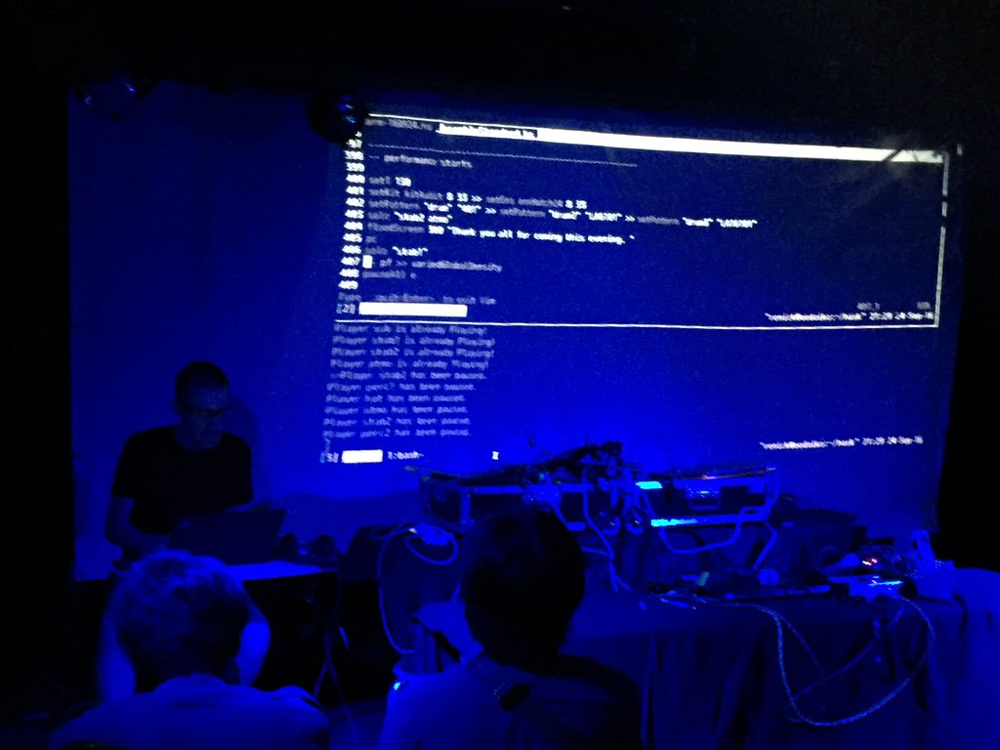

## FARM 2021 Call for Papers, Demos, and Performances

Virtual, August 27, 2021

### Key Dates

#### Papers and Demos

| Paper submission deadline        || May 15 |
| Author notification              || June 5   |
| Camera ready                     || June 26   |
| Workshop                         || August 27 |

#### Performances

| Performance submission deadline  || June 13 |
| Performance notification         || June 26 |

### Call for Papers

After an 2020 online edition restricted to the performance session,
the ACM SIGPLAN International Workshop on Functional Art, Music,
Modelling and Design (FARM) will also be held online in 2021 but open
to all tracks (paper, demo and performance). Pursuing its mission,
this 9th workshop aims to bring together people who are harnessing
functional techniques in the pursuit of creativity and artistic
expression.

FARM encourages submissions from across art, craft, and design,
including textiles, visual art, music, 3D sculpture, animation, GUIs,
video games, 3D printing and architectural models, choreography,
poetry, and even VLSI layouts, GPU configurations, or mechanical
engineering designs. Theoretical foundations, language design,
implementation issues, and applications in industry or the arts are
all within the scope of the workshop.

In addition to the main workshop, FARM hosts a traditional evening of
performances. Thus, this call encompasses both papers/demos for the
workshop (and its published proceedings) as well as performance
proposals for the evening's event. Authors are invited to make a
single submission for each. Authors may submit both a paper/demo and
performance proposal, but the submissions will be considered
independently.

# Note on Finances

Paid registration to the FARM workshop is usually required for paper
and demo submitters, but will be waived for performers.

If you would have financial difficulty attending, you can apply for
conference "PAC" funds. Please get in touch for more information.

# Submission

 

We welcome submissions from academic, professional, and independent
programmers and artists. Submissions are accepted via the [Submission
page on Easychair](https://easychair.org/conferences/?conf=farm2021).

## Paper proposals

Paper submissions are invited in three categories:

- Original research
- Overview / state of the art
- Technology tutorial (especially tools and environments for distributed artistic workflow)

All submissions must propose an original contribution to the FARM
theme. FARM is an interdisciplinary conference, so a wide range of
approaches are encouraged. An original paper should have 5 to 12
pages, be in portable document format (PDF), and use the [ACM SIGPLAN
style guides and ACM SIGPLAN template (using the SIGPLAN
sub-format)](https://www.sigplan.org/Resources/ProceedingsFormat/).
Accepted papers will be published in the ACM Digital
Library as part of the FARM 2021 proceedings.

Authors are encouraged to submit auxiliary material for publication
along with their paper (source code, data, videos, images, etc.);
authors retain all rights to the auxiliary material.

## Demo proposals

Demo proposals should describe a demonstration to be given at the FARM
workshop and its context, connecting it with the themes of FARM. A
demo could be in the form of a short (1020 minute) tutorial,
presentation of work-in-progress, an exhibition of some work, or even
a performance. Demo proposals should be in the form of an extended
abstract (500 to 2000 words). A demo proposal should be clearly marked
as such, by prepending “Demo Proposal:” to the title and proposed to
the 'paper' track. Demo proposals will be published on the FARM
website.

## Performance proposals

FARM seeks proposals for performances which employ functional
programming techniques, in whole or in part. We invite a diverse range
of functionally-themed submissions including music, video, dance, and
performance art. Both live performances and fixed-media submissions
are welcome. We encourage both risk-taking proposals that push forward
the state of the art and refined presentations of highly developed
practice. Performances will be held online.

Performance proposals should be emailed to
[`performance@functional-art.org`](mailto:performance@functional-art.org),
and must include: a description of the performance (please be as
specific as possible), an explanation of the use of functional
programming in the work, and a list of technical requirements. All
proposals should be supported by a link to an audio or video example
(YouTube, Vimeo, Bandcamp, etc.).

 

# Important dates/deadlines:

- Submission Deadline: May, 15th 
- Author Notification: June, 5th 
- Performance Submission Deadlione: June 13th
- Camera Ready: June 26th 
- Performance Notification: June 26
- Workshop: August 27th 

# Authors take note

For original papers and demos, the official publication date is the
date the proceedings are made available in the ACM Digital
Library. This date may be up to two weeks prior to the first day of
the conference. The official publication date affects the deadline for
any patent filings related to published work.

All presentations at FARM 2021 will be recorded. Permission to publish
the resulting video (in all probability on YouTube, along with the
videos of ICFP itself and the other ICFP-colocated events) will be
requested on-site.

# Questions

If you have any questions about what type of contributions that might
be suitable, or anything else regarding submission or the workshop
itself, please contact the organizers at:
[`farm2021@functional-art.org`](farm2021@functional-art.org).

# Workshop organization

- General chair: Daniel Winograd-Cort (Luminous Computing) 
- Program chair: Jean-Louis Giavitto (IRCAM Paris)
- Publicity chair: Mike Sperber (Active Group GmbH)
- Performance Chair: John MacCallum (HfMT Hamburg)
